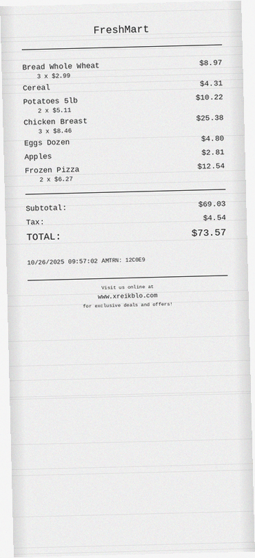
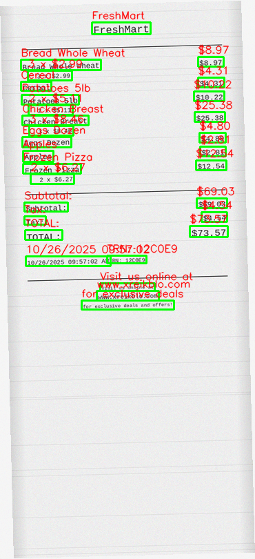

# Receipt Generator for MIE1517

Synthetic receipt generator with accurate ground truth and bounding boxes for training receipt OCR models.

## Installation

```bash
# Use conda environment
conda activate receipt-generator

# Or install requirements
pip install -r requirements.txt
```

## Quick Start

```python
from generate_synthetic_receipts import generate

# Generate receipts
generate(count=1000, output_dir="./data/synthetic", seed=42)
```

Or via command line:
```bash
python generate_synthetic_receipts.py --count 1000 --output ./data/synthetic
```

## Sample Generated Receipt

<table>
<tr>
<td>Original Receipt</td>
<td>With Bounding Boxes (CV2 Style)</td>
</tr>
<tr>
<td></td>
<td></td>
</tr>
</table>

**Sample data files:**
- Ground truth: `samples/synthetic/annotations/000001.json`
- Bounding boxes: `samples/synthetic/bboxes/000001.json`

**To regenerate samples:** Run `python regenerate_samples.py`

## Output Structure

```
samples/synthetic/
├── images/          # Receipt images (*.png)
├── annotations/     # Ground truth JSON (company, date, address, total)
└── bboxes/          # Bounding boxes JSON (with text and coordinates)
```

## Store Types

Supports three store types: `grocery`, `restaurant`, and `retail`. By default, batches include all three types.

You can customize the distribution by specifying `store_types`:

```python
from generate_synthetic_receipts import SyntheticReceiptGenerator

generator = SyntheticReceiptGenerator(output_dir="./data", seed=42)

# Generate more grocery receipts (70% grocery, 20% restaurant, 10% retail)
results = generator.generate_batch(
    count=1000,
    store_types=["grocery"] * 7 + ["restaurant"] * 2 + ["retail"] * 1
)
```

## Visualize Bounding Boxes

```bash
python visualize_bbox.py --id 000001 --data ./data/synthetic
```

## Features

- Accurate bounding boxes with rotation support
- Ground truth generated directly (no OCR needed)
- Realistic augmentations: noise, blur, fold lines, rotations
- Fast generation: ~100 receipts per minute

## API

```python
from generate_synthetic_receipts import generate, SyntheticReceiptGenerator

# Simple generation
generate(count=1000, output_dir="./data/synthetic", bbox_dir="./output/bboxes", seed=42)

# Advanced usage
generator = SyntheticReceiptGenerator(output_dir="./data", seed=42)
result = generator.generate_receipt("receipt_001", store_type="grocery")
results = generator.generate_batch(count=1000, store_types=["grocery", "restaurant", "retail"])
```