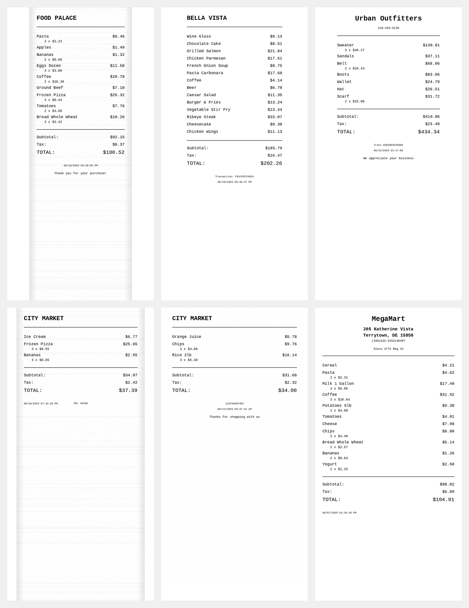

# Receipt Data Generator for MIE1517

A synthetic receipt generator for training CNN models to extract bookkeeping information from receipt images.

## Project Overview

This project, developed for **MIE1517**, generates realistic synthetic receipt images to augment real receipt datasets for training a Convolutional Neural Network (CNN). The CNN's goal is to extract key bookkeeping information:
- **Total amount**
- **Tax amount**
- **Store name**
- **Transaction date**

By mixing synthetic data with real receipts, we prevent overfitting and improve the model's generalization to diverse receipt formats.

## Sample Generated Receipts



*Examples showing the variety of receipt styles, layouts, and formats generated by the system*

## Installation

```bash
# Create conda environment
conda create -n receipt-generator python=3.10 -y
conda activate receipt-generator

# Install dependencies
pip install -r requirements.txt
```

## Usage

### Generate Training Data

```python
from receipt_generator import ReceiptGenerator

# Initialize generator
generator = ReceiptGenerator(
    output_dir="training_data",
    enable_augmentation=True  # Add realistic variations
)

# Generate batch of receipts
results = generator.generate_batch(
    count=1000,  # Number of receipts to generate
    store_types=["grocery", "restaurant", "retail"]
)

print(f"Generated {len(results)} receipts with metadata")
```

### Quick Command Line Usage

```bash
# Generate 500 receipts for training
python generate_receipts.py --count 500 --output-dir training_data

# Generate clean receipts without augmentation
python generate_receipts.py --count 100 --no-augmentation

# Preview a single receipt
python generate_receipts.py --preview
```

## Receipt Variations

The generator creates highly diverse receipts mimicking real-world variety:

### Layout Variations
- **Header styles**: Minimal (name only), Compact (partial info), Standard, or Detailed (full address/phone)
- **Footer styles**: Minimal, Compact, Spread, Standard, or Detailed with varying element placement
- **Element presence**: Thank you messages (40-60% chance), transaction IDs (70% chance), addresses/phones randomly included

### Visual Styles
- **5 printer types**: Thermal, inkjet, dot matrix, modern POS, carbon copy
- **Multiple fonts**: Automatically discovers and uses system fonts with appropriate sizing
- **4 font configurations**: Thermal classic (monospace), Modern POS (sans-serif), Boutique (mixed), Retro (dot matrix)

### Realistic Augmentations
- Rotation (±3°), minimal blur (0-0.5), perspective distortion
- Noise, lighting variations, fold lines, occasional stains
- Character spacing variations (condensed/normal/expanded)

## Generated Data Format

Each receipt consists of:
- **Image file**: PNG receipt image (280-400px width)
- **Metadata JSON**: Ground truth containing:
  ```json
  {
    "store": {"name": "FreshMart", ...},
    "timestamp": "09/28/2025 03:45:22 PM",
    "totals": {
      "subtotal": 45.67,
      "tax": 3.65,
      "total": 49.32
    },
    "text_regions": [...]  // Bounding boxes for all text
  }
  ```

## CNN Architecture

### Proposed Pipeline

```
1. Input Preprocessing
   ├── Receipt photo (variable size)
   ├── Document rectification (perspective correction)
   ├── Resize to fixed dimensions (512x768)
   └── Normalize pixel values

2. Feature Extraction (CNN Backbone)
   ├── Conv2D + ReLU + MaxPool (64 filters)
   ├── Conv2D + ReLU + MaxPool (128 filters)
   ├── Conv2D + ReLU + MaxPool (256 filters)
   └── Conv2D + ReLU + MaxPool (512 filters)

3. Multi-Task Output Heads
   ├── Text Detection Branch → bounding boxes
   ├── OCR Branch → text content
   └── Information Extraction → total, tax, store, date
```

**Why this architecture:** The multi-task approach shares feature learning across related tasks (text detection helps Optical Character Recognition-OCR, which helps extraction), improving efficiency and accuracy compared to separate models.

### Training Strategy

1. **Stage 1**: Pre-train on synthetic data only
2. **Stage 2**: Fine-tune on mixed dataset (70% synthetic, 30% real)
3. **Stage 3**: Final fine-tuning on real receipts only

**Why this strategy:** Starting with clean synthetic data helps the model learn basic patterns without noise. Gradual introduction of real data prevents overfitting while maintaining generalization. The staged approach ensures stable learning progression.

## Project Structure

```
├── generator.py        # Main generation logic
├── templates.py        # Receipt layout templates with variations
├── renderer.py         # Anti-aliased text rendering
├── augmentation.py     # Realistic image effects
├── styles.py          # Printer style variations
├── fonts.py           # Smart font discovery and management
└── data_generator.py  # Product/store data generation
```
